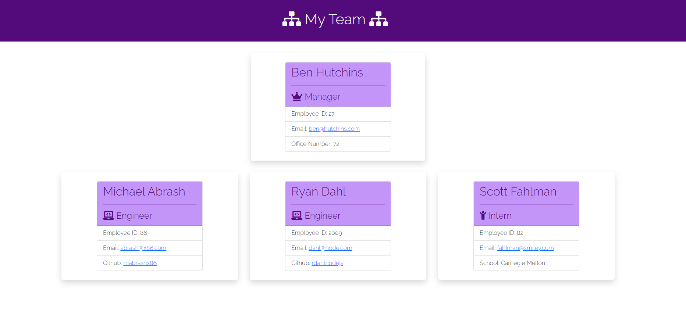

# Team Profile Generator

Tenth week's homework for UNH Full-Stack Web Development Boot Camp

***

## Description

The goal of this project was to create a Node.js command-line application, using JavaScript with [Inquirer package](https://www.npmjs.com/package/inquirer), that the user provides information about employees who will be on a software engineering team. The application will automatically create a HTML webpage that displays directory informational summaries for each team member.

***

## Table of Contents

- [Technology Used](#technology-used)

- [Repository](#repository)

- [Link to Full Video](#link-to-full-video)

- [GIF](#gif)

- [Screenshot](#screenshot)

- [Installation](#installation)

- [Usage](#usage)

- [Tests](#tests)

- [Credits](#credits)

- [Questions](#questions)

- [License](#license)

***

## Technology Used

- [Visual Studio Code](https://code.visualstudio.com/)
- [Bootstrap](https://getbootstrap.com/)
- [Node.js](https://nodejs.org/en/)
- [Inquirer package](https://www.npmjs.com/package/inquirer)
- [Jest package](https://www.npmjs.com/package/jest)
- [GitHub GUI](https://desktop.github.com/)
- [GitHub](https://www.github.com)

***

## Repository

- [GitHub Repository](https://github.com/tracye1083/Team-Profile-Generator)

***

## Link to Full Video

[Link to view Full Video of Application](https://drive.google.com/file/d/12EayNTRcEaAzzwg1G8ecxocXsn2mLM3V/view)

***

## GIF

***

## Screenshot

***

## Installation

~~~javascript
npm install
~~~

***

## Usage

~~~javascript
npm start
~~~

1. Answer the questions in the terminal.

2. Once you are satisfied with the number of members on your team, select 'I'm done!'

3. To view your generated HTML page, open the output directory, right-click team.HTML and open it in your default browser.

***

## Tests

Tests preformed using [Jest package](https://www.npmjs.com/package/jest)

~~~javascript
npm test
~~~

***

## Credits

My full-stack web development course is being offered as a collaboration between Trilogy Education Services and UNH Professional Development and Training.

- Instructor - Benjamin Hutchins [GitHub](https://github.com/benhutchins)
- TA - Andrew Hatfield

***

## Questions

If you have any questions about the repo you can open an issue.

You can find more of my work at [Github](https://www.github.com/tracye1083)

***

## License

This project is licensed under the [MIT License](https://choosealicense.com/licenses/mit).

Copyright (c) 2021 Tracy Angell

Permission is hereby granted, free of charge, to any person obtaining a copy of this software and associated documentation files (the "Software"), to deal in the Software without restriction, including without limitation the rights to use, copy, modify, merge, publish, distribute, sublicense, and/or sell copies of the Software, and to permit persons to whom the Software is furnished to do so, subject to the following conditions:

The above copyright notice and this permission notice shall be included in all copies or substantial portions of the Software.

THE SOFTWARE IS PROVIDED "AS IS", WITHOUT WARRANTY OF ANY KIND, EXPRESS OR IMPLIED, INCLUDING BUT NOT LIMITED TO THE WARRANTIES OF MERCHANTABILITY, FITNESS FOR A PARTICULAR PURPOSE AND NONINFRINGEMENT. IN NO EVENT SHALL THE AUTHORS OR COPYRIGHT HOLDERS BE LIABLE FOR ANY CLAIM, DAMAGES OR OTHER LIABILITY, WHETHER IN AN ACTION OF CONTRACT, TORT OR OTHERWISE, ARISING FROM, OUT OF OR IN CONNECTION WITH THE SOFTWARE OR THE USE OR OTHER DEALINGS IN THE
SOFTWARE.
